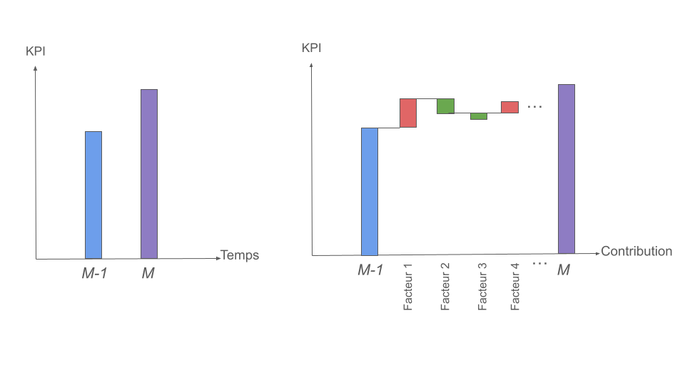
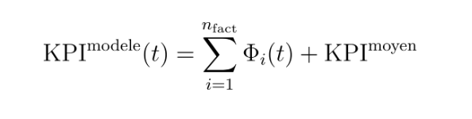
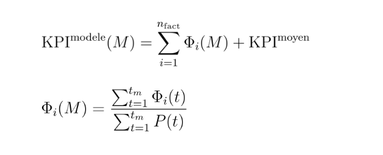
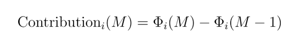
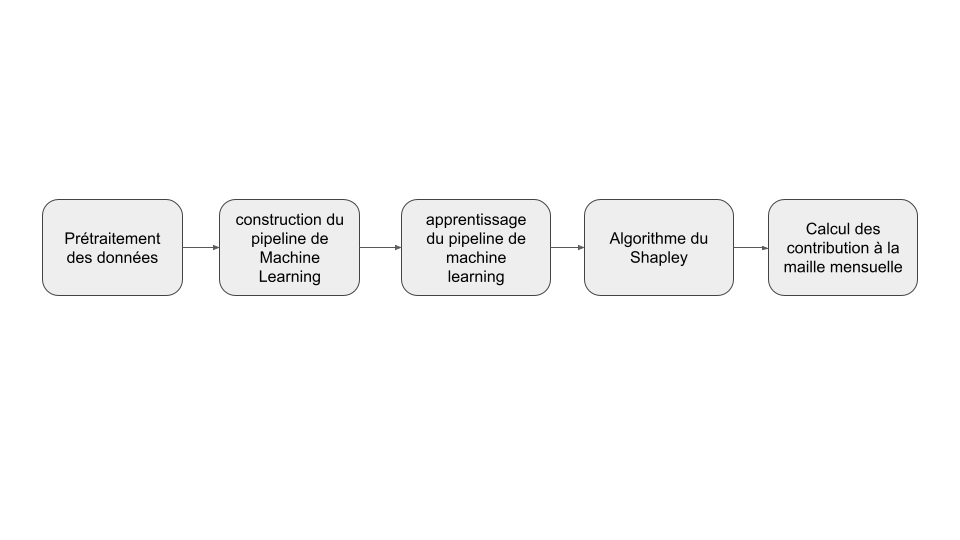

# Energetic-performance-explainability

## Contexte et Objectif
Lors de mes cas d'études réalisés pour des industriels de l'énergie, il m'a fréquemment été demandé d'expliquer les variations
de la performance énergétique d'un jour à l'autre ou d'un mois "M" par rapport à un mois précédent "M-1".
Pour mesurer la performance énergétique d'un procédé industriel qui manufacture un produit, on utilise fréquemment un indicateur (KPI ou IPE) de consommation spécifique (en kWh/t, GJ/t, kWh/m3...)
La problématique conciste donc à expliquer les facteurs responsables des variations entres 2 périodes (mois "M" et "M-1" sur la figure ci-dessous)

  

Ce démonstrateur, basé sur des données synthétiques, illustre un cas d'étude.

## Démarche

L'explicabilité des variation de performances est basée sur la réalisation d'un modèle du KPI en fonctions des facteurs influants la performance énergétique du procédé étudié.
Dans le cas où le modèle est une régression linéaire on a: 

  

la contribution de chaque facteur à la variation du KPI correpond au produit du coefficient du facteur multiplié par la différences des valeurs des facteurs entre les 2 périodes ("M" et "M-1").
Le terme d'erreur correspond à la part non expliquée par le modèle, que l'on espère le plus faible possible.

Dans le cas où le modèle n'est pas une régression linéaire, il y'a 2 points à prendre en compte:
- On dispose généralement de données à une maille temporelle "t" plus fine que le Mois (minute, heure,...) ce qui permet de rechercher un modèle plus robuste qu'une simple régression linéaire (XGBoost, LightGBM, etc.)
- Si l'on emploi un modèle "boite noire" difficilement intérprétables (non-paramétriques par exemple) il est nécessaire de disposer d'outils pour calculer les contributions des facteurs

Concernant le 2ème point, nous utilison la méthode du Shapley qui permet, pour chaque point "t", d'approximer le modèle initial sous la forme d'une valeur moyenne (sur la période) de la variable modélisée + une somme de contributions de chaque facteurs:

  

Le 1er point implique que si la maille d'analyse est le mois, il est nécessaire de passer de l'échelle "t" à l'échelle mensuelle. Dans le cas où le KPI est une consommation spécifique (par exemple une consommation / production), on peut montrer algébriquement que la contribution s'écrit comme la somme des contributions à la maille "t" pondérée par la production mensuelle:

  

L'équation ci-dessus n'est valable que si il n'y a pas de consommations à production nulle, ce qui peut être le cas lors de périodes de veille d'un procédé (on continu à consommer de l'énergie sans produire)
Dans ce cas il faut intégrer un terme de variation de performance lié aux périodes de veilles.

la contribution de chaque facteur à la variation du KPI entre "M" et "M-1" s'écrit finalement:

  

Et:

  

La démarche générale, détaillée dans le notebook, est illustrée ci-dessous:

  

## sources

[shapeley](https://shap.readthedocs.io/en/latest/example_notebooks/overviews/An%20introduction%20to%20explainable%20AI%20with%20Shapley%20values.html)
